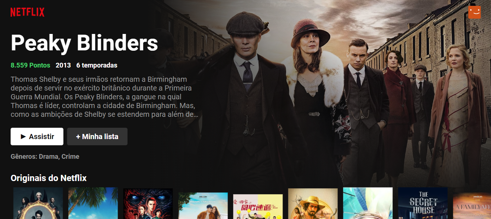

# NETFLIX CLONE

      
 

## Objetivo:

### Foi criar um site o mais similar possivel com o da netflix, principalmente em aspectos visuais.

## Descrição:

- `A capa da aplicação é atualizada de forma aleatória toda vez que a página for carregada.`
- `Na capa irá mostrar informações especificas da série selecionada.`
- `Há várias categorias de filmes.`
- `Cada categorias há um botão para mover as categorias para o lado.`

## <i>Douglas Monteiro</i> 😁🔥🚀
